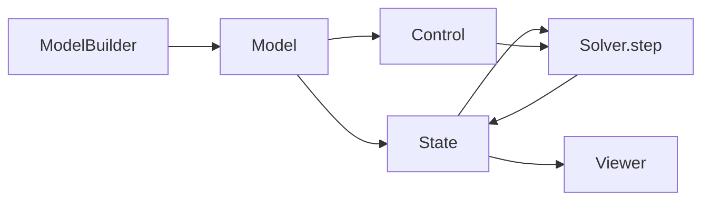

# CLAUDE.md

This file provides guidance to Claude Code (claude.ai/code) when working with code in this repository.

@AGENTS.md

## Newton Project Overview

Newton is a GPU-accelerated physics simulation engine built on NVIDIA Warp, targeting roboticists and simulation researchers. It extends Warp's deprecated `warp.sim` module and integrates MuJoCo Warp as its primary backend.

## Common Development Commands

### Running Examples

```bash
# Set up environment for examples
uv sync --extra examples

# Run a specific example
uv run -m newton.examples basic_pendulum

# List all available examples
uv run -m newton.examples

# Run example with specific options
uv run -m newton.examples basic_viewer --viewer usd --output-path my_output.usd --device cuda:0

# Run examples requiring PyTorch
uv run --extra torch-cu12 -m newton.examples robot_policy
```

### Testing

```bash
# Run all tests
uv run --extra dev -m newton.tests

# Run tests including PyTorch-dependent tests
uv run --extra dev --extra torch-cu12 -m newton.tests

# Run a specific example test
uv run --extra dev -m newton.tests.test_examples -k test_basic.example_basic_shapes

# Run with coverage report
uv run --extra dev -m newton.tests --coverage --coverage-html htmlcov
```

### Linting and Formatting

```bash
# Run all pre-commit hooks
uvx pre-commit run -a

# Install pre-commit hooks
uvx pre-commit install

# Check for typos
uvx typos
```

### Documentation

```bash
# Build documentation
rm -rf docs/_build
uv run --extra docs --extra sim sphinx-build -W -b html docs docs/_build/html

# Serve documentation locally (required for Viser visualizations)
uv run docs/serve.py

# Test documentation code snippets
uv run --extra docs --extra sim sphinx-build -W -b doctest docs docs/_build/doctest

# Update auto-generated API documentation
python docs/generate_api.py
```

### Benchmarking (ASV)

```bash
# Unix shells
uvx --with virtualenv asv run --launch-method spawn main^!

# Windows CMD (escape ^ as ^^)
uvx --with virtualenv asv run --launch-method spawn main^^!

# Run specific benchmark
asv run --launch-method spawn main^! --bench example_anymal.PretrainedSimulate

# Show benchmark durations
asv run --launch-method spawn main^! --durations all
```

### Dependency Management

```bash
# Update specific package in lockfile
uv lock --upgrade-package warp-lang
uv lock --upgrade-package mujoco-warp

# Update all dependencies
uv lock -U

# Use local Warp installation
uv venv
source .venv/bin/activate
uv sync --extra dev
uv pip install -e "warp-lang @ ../warp"
```

## Code Architecture

### Public API and Internal Implementation Boundary

Newton strictly separates its public API from internal implementation:

- **`newton/_src/`**: Internal library implementation. This directory contains all implementation details.
- **`newton/*.py`**: Public API modules that re-export symbols from `_src/`. These are the only modules users should import from.

User code (including examples under `newton/examples/`) MUST NOT import from `newton._src`. All user-facing functionality must be exposed through public modules like `newton.geometry`, `newton.solvers`, `newton.sensors`, etc.

### Module Structure

- **`newton/_src/core/`**: Core types and utilities (Axis, AxisType, MAXVAL)
- **`newton/_src/geometry/`**: Collision detection, broad phase algorithms, SDF utilities, mesh processing, inertia calculations
- **`newton/_src/sim/`**: Core simulation infrastructure
  - `model.py`: `Model` class representing the physical system
  - `builder.py`: `ModelBuilder` class for constructing models
  - `state.py`: `State` class for simulation state
  - `control.py`: `Control` class for actuator commands
  - `contacts.py`: `Contacts` class for collision response
  - `articulation.py`: Articulated body system handling
  - `joints.py`: Joint constraint implementations
  - `collide.py` / `collide_unified.py`: Collision pipeline implementations
  - `ik/`: Inverse kinematics solvers
- **`newton/_src/solvers/`**: Time integration solvers (SolverBase, SolverMuJoCo, SolverXPBD, SolverGlobalPBD, SolverElastic, SolverMPM, etc.)
- **`newton/_src/sensors/`**: Sensor implementations (contact, IMU, camera, raycast, frame transform)
- **`newton/_src/viewer/`**: Visualization backends (OpenGL, USD, ReRun, Viser)
- **`newton/_src/utils/`**: Utilities for assets, URDF/USD loading, logging, etc.
- **`newton/_src/usd/`**: OpenUSD integration utilities

### Simulation Workflow

The typical Newton workflow follows this pattern:

1. **Build**: Use `newton.ModelBuilder()` to construct a model by adding links, shapes, joints, and articulations
2. **Finalize**: Call `builder.finalize()` to create a `newton.Model`
3. **Initialize**: Create `newton.State` and `newton.Control` objects
4. **Simulate**: Use a solver's `step()` method to advance the simulation
5. **Visualize**: Optionally render with a viewer



### Examples Pattern

All examples follow a consistent structure with an `Example` class:

```python
class Example:
    def __init__(self, viewer, args=None):
        # Set up simulation parameters (fps, dt, substeps)
        # Build model using newton.ModelBuilder()
        # Finalize model and create state
        # Initialize viewer

    def step(self):
        # Advance simulation by one frame
        # Update viewer

    def render(self):
        # Render current state

    def test_final(self):
        # Validation method run after simulation completes
        # REQUIRED for all examples

    def test_post_step(self):
        # Optional validation after each step
```

### Key Design Patterns

1. **Warp Integration**: Newton heavily uses Warp kernels for GPU-accelerated computation. Many functions are decorated with `@wp.kernel` or `@wp.func`.

2. **MuJoCo Backend**: The primary physics backend is MuJoCo Warp, integrated through the `SolverMuJoCo` class.

3. **Unified vs. Legacy Collision**: Two collision pipeline implementations exist:
   - `CollisionPipelineUnified`: New unified pipeline
   - `CollisionPipeline`: Legacy pipeline (being phased out)

4. **Selection System**: The `selection` module provides powerful filtering and selection of model elements (articulations, bodies, shapes, etc.) for batched operations.

5. **Differentiability**: Many solvers support automatic differentiation through Warp's AD system for gradient-based optimization and learning.

## Development Notes

- Always run `uvx pre-commit run -a` before committing
- When adding public API symbols under `_src/`, ensure they're re-exported in the appropriate public module
- Update `docs/generate_api.py` documentation when adding new public API
- New examples must be added to the appropriate table in `README.md` with screenshot and uv command
- Follow conventional commit message practices (see Apache Airflow's PR guidelines linked in AGENTS.md)
- Use `kebab-case` for CLI arguments, `snake_case` for Python code
- Avoid adding new dependencies when possible; strongly prefer using existing Warp, NumPy, or stdlib functionality
