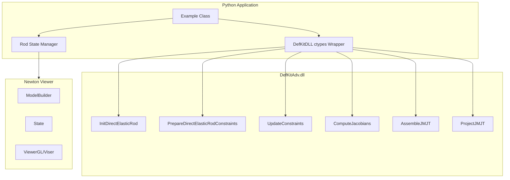
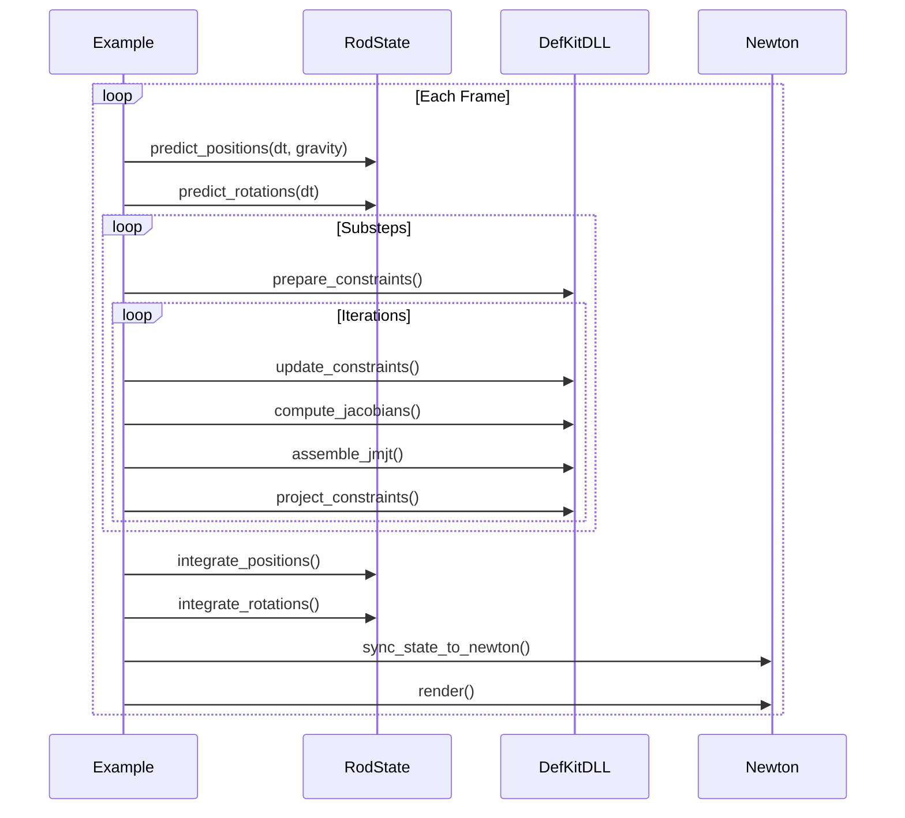

# DefKitAdv DLL Python Integration Plan

## Overview

This plan implements a Python application in `newton/examples/cosserat3/cosserat_opus.py` that calls the `DefKitAdv.dll` C++ library to simulate Cosserat rods using Position Based Dynamics (PBD). Newton serves as the visualization backend.

The implementation starts with the iterative "Position and Orientation Based Cosserat Rods" solver from the paper by Kugelstadt & Schömer (2016), with the option to use the direct solver from "Direct Position-Based Solver for Stiff Rods" (Deul et al.).

## Architecture



## Implementation Components

### 1. ctypes Data Structures

Matching the C++ Bullet Physics library types:

- **btVector3**: 4 floats (x, y, z, w) for 16-byte alignment
- **btQuaternion**: 4 floats (x, y, z, w) matching Bullet's convention

### 2. DefKitDLL Wrapper Class

Wraps all exported DLL functions:

| Function | Purpose |
|----------|---------|
| `InitDirectElasticRod` | Initialize rod solver with positions, orientations, material properties |
| `PrepareDirectElasticRodConstraints` | Set up constraints before projection (reset lambdas, compute compliance) |
| `UpdateConstraints_DirectElasticRodConstraintsBanded` | Update constraint info with current state |
| `ComputeJacobians_DirectElasticRodConstraintsBanded` | Compute constraint Jacobians |
| `AssembleJMJT_DirectElasticRodConstraintsBanded` | Assemble banded system matrix |
| `ProjectJMJT_DirectElasticRodConstraintsBanded` | Solve system and apply corrections |
| `DestroyDirectElasticRod` | Clean up resources |

### 3. RodState Class

Manages simulation state:

- **Position arrays**: positions, predicted_positions, prev_positions, velocities, forces
- **Orientation arrays**: orientations, predicted_orientations, prev_orientations, angular_velocities, torques
- **Mass arrays**: particle_inv_mass, quat_inv_mass
- **Rest configuration**: rest_lengths, rest_darboux, bend_stiffness

### 4. PBD Integration Functions

Python fallback implementations for when DLL is not available:

- `predict_positions()`: Semi-implicit Euler for positions
- `predict_rotations()`: Quaternion integration for orientations
- `integrate_positions()`: Velocity update from position changes
- `integrate_rotations()`: Angular velocity update from orientation changes

### 5. Example Class

Following Newton's example pattern:

- `__init__()`: Set up simulation, load DLL, build Newton model
- `step()`: Run simulation substeps
- `render()`: Visualize state with Newton viewer
- `gui()`: ImGui controls for parameters
- `test_final()`: Validation after simulation

## Simulation Loop



## DLL API Details

### Data Flow

1. **Initialization**: Create rod with initial positions, orientations, material properties
2. **Per-timestep preparation**: Reset lambda accumulators, compute compliance from stiffness
3. **Per-iteration**:
   - Update constraint connectors from current state
   - Compute Jacobians (stretch, bending, torsion)
   - Assemble banded JMJT matrix
   - Solve banded system (Cholesky)
   - Apply position and orientation corrections

### Memory Layout

The DLL expects arrays in specific formats:

- **Positions**: Array of `btVector3` (16 bytes each)
- **Orientations**: Array of `btQuaternion` (16 bytes each, x,y,z,w order)
- **Scalars**: Array of `float` (4 bytes each)

## Usage

```bash
# Run with Newton viewer
uv run python newton/examples/cosserat3/cosserat_opus.py

# Run with specific viewer
uv run python newton/examples/cosserat3/cosserat_opus.py --viewer viser
```

## Dependencies

- **Required**: numpy, warp, newton
- **Optional**: DefKitAdv.dll (falls back to Python solver if not available)

## Reference Papers

1. Kugelstadt, T., & Schömer, E. (2016). "Position and Orientation Based Cosserat Rods" - https://animation.rwth-aachen.de/publication/0550/
2. Deul, C., et al. (2018). "Direct Position-Based Solver for Stiff Rods" - https://animation.rwth-aachen.de/publication/0557/

## Files Created

- `newton/examples/cosserat3/__init__.py` - Package init
- `newton/examples/cosserat3/cosserat_opus.py` - Main implementation
