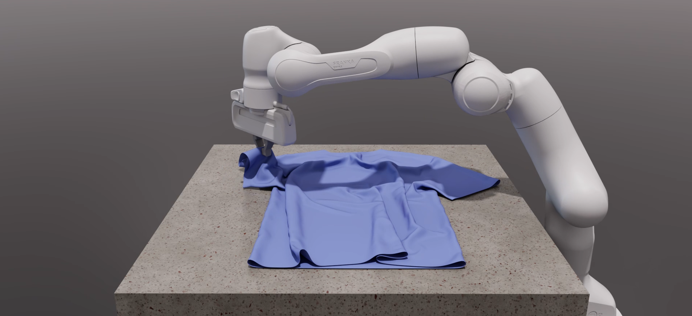

Newton Physics 
===============

.. toctree::
   :maxdepth: 1

   overview
   quickstart
   tutorials
   key-concepts

**Newton** is a modern physics engine designed for simulation, robotics, and graphics applications. It provides a flexible architecture with multiple solvers and integrators to suit your specific needs.

Key Features
-----------

* **Multiple solver implementations** - XPBD, VBD, Mujoco, Featherstone, Euler
* **Modular design** - Easily extendable with new solvers and components
* **Import from various formats** - USD, URDF, MJCF support
* **Highly optimized** - Designed for performance-critical applications
* **Well-documented API** - Comprehensive Python and C++ interfaces

.. code-block:: python
   :caption: Simple pendulum example
   :linenos:

   import newton as nw
   
   # Create a new physics model
   model = nw.Model()
   
   # Add a pendulum
   body = model.add_body(mass=1.0)
   joint = model.add_joint(
       type=nw.JointType.REVOLUTE,
       parent=model.ground,
       child=body,
       axis=[0, 0, 1]
   )
   
   # Create solver and simulate
   solver = nw.solvers.XPBD(model)
   
   for i in range(100):
       solver.step(dt=0.01)
       print(f"Angle: {joint.get_position()}")

.. toctree::
   :maxdepth: 1
   :caption: User Guide

   guide/overview

.. toctree::
   :maxdepth: 1
   :caption: API Reference

   api

:ref:`Full Index <genindex>`\